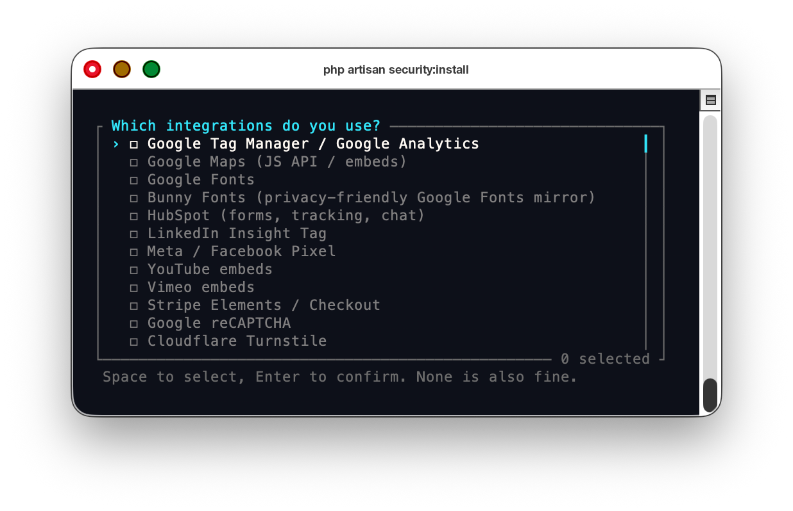

# Laravel Security

[](https://packagist.org/packages/make-dev/laravel-security)
[](https://packagist.org/packages/make-dev/laravel-security)

> Composer package: `make-dev/laravel-security` · PHP namespace: `MakeDev\Security`

A drop-in security headers package for Laravel that ships sensible defaults for HSTS, Content Security Policy (with per-request nonces and `'strict-dynamic'`), X-Content-Type-Options, Permissions-Policy, and Subresource Integrity — plus first-party endpoints for receiving CSP and SRI violation reports. Supports Laravel 11, 12, and 13 on PHP 8.2 – 8.5.

## Features

- **Strict-Transport-Security (HSTS)** — configurable `max-age`, `includeSubDomains`, `preload`.
- **Content-Security-Policy** — directive map in config, optional report-only mode, multi-host CDN/asset-domain injection, per-path exclusions.
- **Strict CSP via per-request nonces + `'strict-dynamic'`** — auto-generated nonce bound to a singleton per request, `@cspNonce` Blade directive, optional response-time auto-injection on every `<script>` tag (catches CMS-rendered raw HTML without per-template plumbing).
- **X-Content-Type-Options** — `nosniff`.
- **Permissions-Policy** — feature allowlist map; defaults deny `camera`, `geolocation`, `microphone`, `payment`, etc.
- **Subresource Integrity (SRI)** — hashes assets at build time, rewrites `<link>` and `<script>` tags on the fly with a host allowlist + skip-pattern list, injects a tiny browser observer that reports only on tags it actually pinned (via a `data-sri-managed` marker, so third-party SRI noise stays out of your reports).
- **Violation reporting** — built-in routes for CSP and SRI reports, written to a log channel and optionally persisted to the database. Defense-in-depth host filter on the SRI report endpoint drops anything outside the allowlist.
- **Vapor-friendly** — SRI manifest lives in `bootstrap/cache/` so it ships inside the Lambda code bundle; supports a two-stage build/warm flow for CSS files that are post-processed at deploy time.

Header-only middlewares register globally (via the HTTP kernel), so they cover 404s and other unmatched-route responses. The HTML-rewriting SRI middleware is appended to the `web` group only.

## Requirements

- PHP 8.2 – 8.5
- Laravel 11, 12, or 13 (`illuminate/support`, `illuminate/http`)

## Installation

```bash
composer require make-dev/laravel-security
```

The service provider is auto-discovered. The fastest way to get a tailored config is the interactive setup wizard:

```bash
php artisan security:install
```



The wizard walks you through each header, explains the trade-offs (with brief pros/cons), and asks which third-party integrations you use — Google Tag Manager / Analytics, Google Maps, HubSpot, LinkedIn, YouTube, Stripe, reCAPTCHA, Sentry, Intercom, etc. — auto-populating the right CSP directives for each. It writes `config/security.php` (backing up any existing file).

Prefer to start from the defaults and edit by hand? Publish the stock config:

```bash
php artisan vendor:publish --tag=make-dev-laravel-security
```

Either way, migrations for the `csp_reports` and `sri_reports` tables are auto-loaded (no publish required) and run on the next `php artisan migrate` if DB persistence is enabled.

## Configuration

Everything lives in `config/security.php`. The most useful knobs are also wired to env vars:

| Env var | Default | Purpose |
| --- | --- | --- |
| `CSP_ENABLED` | `true` | Master switch for the CSP header. |
| `CSP_REPORT_ONLY` | `true` | Send `Content-Security-Policy-Report-Only` instead of enforcing. |
| `CSP_REPORT_URI` | `null` | Override the report endpoint; falls back to the registered route. |
| `CSP_REPORT_ROUTE` | `true` | Register the built-in `POST /csp-report` route. |
| `CSP_REPORT_PATH` | `/csp-report` | Route path. |
| `CSP_REPORT_THROTTLE` | `60,1` | Laravel `throttle:` rate. |
| `CSP_REPORT_DB` | `true` | Persist reports to `csp_reports`. |
| `CSP_ASSET_DOMAIN` | `null` | CDN/asset host appended to `script-src`, `style-src`, `img-src`, `font-src`, `connect-src`, `media-src`. Single URL string, comma-separated string, or array. |
| `CSP_NONCE` | `true` | Generate a per-request nonce and append it to `script-src`. Required to use `@cspNonce`. |
| `CSP_STRICT_DYNAMIC` | `true` | Append `'strict-dynamic'` to `script-src` so nonced scripts can load further scripts without per-vendor allowlists (modern browsers; old browsers fall back to the origin allowlist). |
| `CSP_NONCE_AUTO_INJECT` | `true` | Have the SRI middleware also inject `nonce="…"` on every `<script>` tag that doesn't already have one. Catches CMS-rendered inline scripts; disable if you render user-generated HTML through `{!! !!}`. |
| `SRI_ENABLED` | `true` | Master switch for SRI rewriting. |
| `SRI_REPORT_ROUTE` | `true` | Register `POST /sri-report`. |
| `SRI_REPORT_OBSERVER` | `true` | Inject the inline browser observer that POSTs SRI failures. |
| `SRI_CACHE_STORE` | `null` | Cache store for post-deploy hash overlay (use redis/dynamodb on Vapor). |

See the published `config/security.php` for the full directive maps and inline documentation.

### Excluding paths

Both CSP and SRI accept an `exclude_paths` array. Useful for admin panels, Livewire endpoints, or anything that ships its own asset pipeline:

```php
'exclude_paths' => ['admin', 'livewire'],
```

Matched with `str_starts_with()` against `$request->path()`.

### Multiple asset hosts

`csp.asset_domain` accepts a single string, an array, or a comma-separated env value. Each host is auto-appended to `script-src`, `style-src`, `img-src`, `font-src`, `connect-src`, and `media-src`, and each becomes eligible for SRI pinning via the `'asset'` token in `sri.host_allowlist`:

```php
'asset_domain' => env('CSP_ASSET_DOMAIN', [
    'https://cdn.example.com',
    'https://bucket.s3.us-west-2.amazonaws.com',
]),
```

## Strict CSP — nonces + `'strict-dynamic'`

The package implements [Google's Strict CSP pattern](https://csp.withgoogle.com/docs/strict-csp.html) by default: a per-request nonce is appended to `script-src`, and `'strict-dynamic'` lets nonced scripts load further scripts without per-vendor allowlists (modern browsers; the origin allowlist remains as fallback for old browsers).

### Marking trusted inline scripts

In Blade templates, mark trusted inline `<script>` tags with the `@cspNonce` directive:

```blade
<script @cspNonce>
    // your trusted inline JS
</script>
```

Vendor loaders (GTM, HubSpot, reCAPTCHA, etc.) need the same treatment so `'strict-dynamic'` can extend trust to the scripts they inject:

```blade
<script @cspNonce src="https://www.google.com/recaptcha/api.js" async defer></script>
```

For CMS-rendered raw HTML output via `{!! $block['html'] !!}` (Filament Fabricator's `html` block, etc.), `auto_inject` (default on) makes the SRI middleware add `nonce="…"` to any `<script>` tag in the response that doesn't already have one. No per-template plumbing needed.

### Wiring third-party integrations

Laravel's Vite directive needs the nonce passed through:

```php
// AppServiceProvider::boot()
if (config('security.csp.nonce.enabled')) {
    \Illuminate\Support\Facades\Vite::useCspNonce(
        app(\MakeDev\Security\Services\CspNonce::class)->value()
    );
}
```

Filament 3 panels:

```php
->cspNonce(fn () => app(\MakeDev\Security\Services\CspNonce::class)->value())
```

Livewire 3 auto-detects a nonce when one is present in the page `<head>`.

### Trust model for `auto_inject`

The server-rendered response is treated as server-trusted by design — auto-nonce-ing inline scripts is no more permissive than the same markup hand-written into a Blade template with `@cspNonce`. If you render *user-generated* HTML through `{!! !!}` (forum posts, comments, etc.), set `CSP_NONCE_AUTO_INJECT=false` and gate trust per-template.

### Inline styles

`'unsafe-inline'` is acceptable for `style-src` on most CMS/marketing sites: inline `style="…"` attributes are pervasive in framework output (Filament, TinyMCE, page builders) and can't exfiltrate data the way inline scripts can. The default config ships with `'unsafe-inline'` in both `style-src` and `style-src-attr`. There is no equivalent strict-dynamic mechanism for styles.

## Subresource Integrity

The SRI subsystem has four pieces:

1. **A manifest** of asset path → `sha384-…` hash, written to `bootstrap/cache/sri-manifest.json`.
2. **A middleware** that scans HTML responses for `<link>` and `<script>` tags whose `href`/`src` is in the manifest, and injects matching `integrity` and (cross-origin only) `crossorigin="anonymous"` attributes. Tagged with `data-sri-managed=""` so the observer can distinguish what the package pinned from what third parties pin themselves.
3. **A host allowlist** — `sri.host_allowlist` controls which origins are eligible for pinning. Defaults to `['self', 'asset']` (request host + every host listed in `csp.asset_domain`). Pinning mutable third-party CDNs (reCAPTCHA, GTM) produces noise rather than signal — those origins should be governed by CSP, not SRI.
4. **Skip patterns** — `sri.skip_url_patterns` is a substring match list applied to URLs at injection time. Default `['/livewire/']` skips Livewire's bundled JS, which is served through a controller that bakes per-request config into the response (manifest hashes don't match across deploys/preview environments).
5. **A failure observer** — a small inline script in `<head>` that listens for `error` events on tags carrying `data-sri-managed` and POSTs a JSON report to the configured endpoint. Browsers do not send CSP reports for plain SRI mismatches, so this fills the gap. Carries the request's CSP nonce when nonces are enabled.

### Build the manifest

Run during your deploy build (after `npm run build` / `vite build`):

```bash
php artisan sri:build-manifest
```

Scans the directories listed in `security.sri.scan_dirs` (default: `build`, `css`, `js`) under `public/` for `.js` and `.css` files, hashes them with the configured algorithm, and writes the manifest.

For environments where CSS is post-processed at deploy time (e.g. Vapor) and is not yet final at build time:

```bash
php artisan sri:build-manifest --skip-css
php artisan sri:warm
```

`--skip-css` writes CSS entries with `null` hashes. `sri:warm` then fetches each pending entry over HTTP from `app.asset_url` (or `app.url` for paths listed in `security.sri.warm_from_app`) and stores the resulting hash in the configured cache store. The middleware reads the manifest first and the cache overlay second.

`security.sri.warm_from_app` covers paths served dynamically by the application host rather than from `public/` — for example, Livewire serves its bundled JS through a route, so the default config lists `/livewire/livewire.min.js` and `/livewire/livewire.js`.

## Violation reporting

When `register_route` is enabled, the package mounts:

- `POST /csp-report` — accepts `application/csp-report` and `application/reports+json` payloads.
- `POST /sri-report` — accepts the JSON payload sent by the injected observer.

Both routes are registered **outside** the `web` middleware group (no session, no CSRF) and rate-limited via `throttle:`. Reports are written to the configured log channel and, if `store_in_db` is true, persisted to the `csp_reports` / `sri_reports` tables. Set `connection` to route writes to a non-default DB.

If you'd rather POST to a third-party reporting service, set `security.csp.report_uri` (CSP) or `security.sri.report.endpoint` (SRI) and disable `register_route`.

## How it's wired

The service provider:

- Binds `MakeDev\Security\Services\CspNonce` and `MakeDev\Security\Services\SriManifest` as singletons.
- Registers the `@cspNonce` Blade directive.
- Pushes `StrictTransportSecurity`, `ContentSecurityPolicy`, `XContentTypeOptions`, and `PermissionsPolicy` onto the global middleware stack via the HTTP kernel — so headers cover 404s and other unmatched-route responses, which never reach the `web` group.
- Appends `SubresourceIntegrity` to the `web` group, since it only makes sense on HTML responses from matched routes. This middleware also handles auto-nonce injection.
- Registers the `security:install`, `sri:build-manifest`, and `sri:warm` console commands.
- Conditionally loads the report-table migrations based on the `store_in_db` flags.

## License

MIT. See the `LICENSE.md` file.
